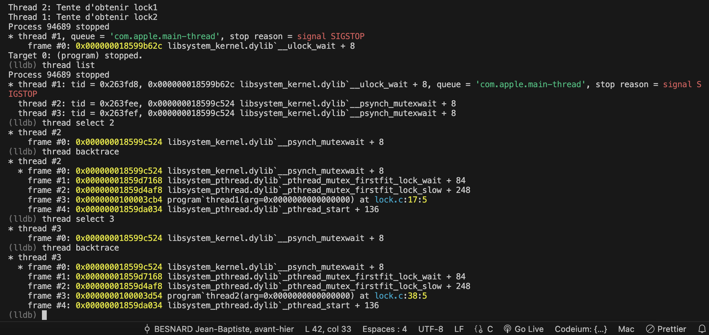

# TP2 - ALIE Norman

## Exercice 1
1. Le code génère une image avec des coulers et des formùes en utilisant le laplacien et des maths
2. En traitement du signal, la convolution est utilisée pour appliquer appliquer un filtre filtre(t) à un signal en combinant la fonction signal(t) et la fonction filtre(t)
Le laplacien est utilisé pour detecter des changements brusques, souvent des bords sur une image
3. Le code 'nest pas fonctionnel -> il génère une erreur de segmentation
4. Le bug était une tentative d'accès à l'index [-1] du tableau ce qui créé une erreur de segmentation -> Première aparition main.c:23 identifié grace à `lldb`
5. Pour le corriger on part de l'indice 1 dans la boucle ce qui fait un 1-1=0 qui est un index valide.

## Exercice 2
1. 
   - Fonction 1: i va jusqu'à size or c'est un tableau donc elle ne devrai pas atteindre size
   - Fonction 2: i va jusqu'a size+50 -> en dehors du tableau
   - Fonction 3: i va jusqu'a size*1000
2.
    - Fonction 1: pas de segfault mais un comportement faux qui va écrire à une mauvaise adresses dans le heap
    - Fonction 2: pas de segfault mais un comportement faux qui va écrire à une mauvaise adresses dans le heap
    - Fonction 3: Segfault
3. `lldb` avec `llef` intègre ASAN et permet d'identifier les erreurs de segmentations qu'elles soient sur la même page ou non. Dans les trois cas `lldb` donne une erreur de segmentation: _Heap buffer overflow_ en précisant la ligne à laquelle s'est produite l'interruption de l'execution. 
4.  Non une corruption ne mêne pas toujours au plantage. Une corruption en dehors du zone mémoire du process mêne à un plantage inité par l'OS. Une corruption dans un zone mémoire du process est à gérer en interne par le process. 

## Exercice 3
1. Une fuite de mémoire est une allocation dynamique qui n'est jamais libérée ce qui entraine une utilisation excessive de la mémoire.
2. La fuite est identifiable avec Valgrind -> On essaie de free des pointeurs NULL et on ne free pas les vraies addresses allouées précédement.
3. On retire la ligne `segments[i++] = NULL;`

## Exercice 4
1. Le programme fait la somme des elements dans le tableau
2. Le programme donne un résultat peut etre faux car il additionne aussi la valeur de sum.
3. Avec gdb on place un breakpoint à la ligne 9 et on affiche la valeur de sum avec `v sum`

## Exercice 5
1. Le code est vulnérable car l'entrée de l'utilisateur n'est pas protégée, il a donc accès à toute la stack
2. La stack au moment de l'appel a vulnerable_function

|STACK|VALUE|
|-|-|
|password_is_good|0|
|buffer[7]|?|
|buffer[6]|?|
|buffer[5]|?|
|buffer[4]|?|
|buffer[3]|?|
|buffer[2]|?|
|buffer[1]|?|
|buffer[0]|?|

3. Pour déclencher l'erreur il faut entrer assez de caractère (9 ou +) pour écrire 98 aka `b`dans password_is_good
4. Pour casser le MDP, il faut entrer le caractère `b`dans password_is_good

## Exercice 6
1. La fonction prend en argument un unsigned, or la décrémentation peut être négative, ce qui fait boucler la valeur unsigned long long a sa valeur max.
2. La condition d'arret doit être `n <= 1`

## Exercice 7
1. Ce que fait le code:
   1. Un thread est une entité programmée pour être executée par le CPU. Là où un processus est un regroupement de ressources, le ou les thread(s) font partie du processus mais les deux modèles sont et peuvent être traités de manière indépendante.
   2. Les mutexs sont une façon de garantir un accès sécurisé à une région critique par un thread. C'est un modèle simplifié du sémaphore. Un mutex est une variable partagée de 1 bit qui peut être modifié par deux opérations atomiques: `lock`et `unlock` qui sont des wrapper de routines assembleurs utilisant `TSL` ou `XCHG`.
   3. Ce code simule un problème de _dead-lock_: Deux threads tentent d'obtenir deux mutexs dans l'ordre inverse l'un de l'autre. De plus, les deux instructions `lock()`sont séparés par un `sleep()`. Chaque thread va donc _yield_ entre l'obtention des deux mutexs.
   La probabilité est alors très grande que l'autre thread prenne le CPU et que l'on se retrouve dans une situation de _dead-lock_
2. Ce code dépend de la bibliothèque `<pthread.h>` qui implémente de modèle POSIX Thread en C.
3. Pourquoi le code ne se termine jamais:
   1. On place des breakpoints sur le lock(mutex1) du threadA et sur le lock(mutex2) du threadB. 
    On execute le programme jusqu'au deadlock avec `run`
    Au deadlock on arrete avec `Ctrl+C`et on inspecte l'état des threads `thread select`puis `thread backtrace`
    On voit que le thread A est bloqué en _mutexwait_ ligne 17 et que le thread B est bloqué en _mutexwait_ ligne 38
    2. 
    3. La commande _GDB_ `thread apply all bt` execute la commande `bt aka. backtrace`sur tout les threads.
 4. Les threads doivent obtenir les lock dans le même ordre ou alors n'utiliser qu'un seul lock. Si un thread doit faire remonter une information à l'autre thread (synchronisation et/ou interlock), il vaut mieux utiliser une _condition variable_ associée à un mutex plutot que 2 mutexs.  